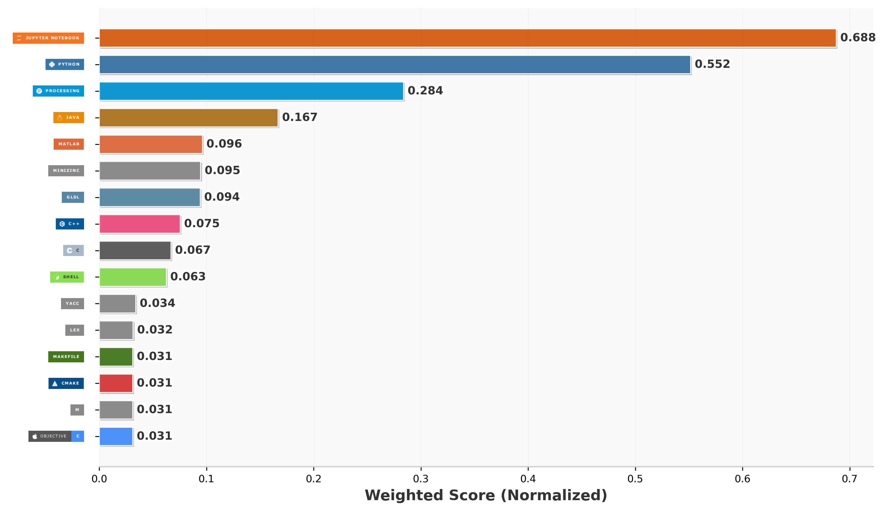

# Leopoldo López Reverón
### Senior ML Engineer · Computer Vision · Edge AI · Real-Time Perception Systems

> I build AI that works in the real world — industrial floors, maritime decks, and edge-constrained hardware where latency, reliability, and observability are non-negotiable.

---

## What I Do

I currently work as a ML Engineer, designing end-to-end AI systems, guiding cross-functional teams, and taking applied research through to production deployment.

My core focus areas:

- **Edge AI & Real-Time Computer Vision** — Deploying optimized models (TensorRT, ONNX, CUDA) on constrained hardware with strict latency budgets
- **Model Optimization** — Quantization, pruning, distillation, GPU acceleration, and streaming pipelines
- **Industrial & Maritime AI** — PPE detection, depth estimation, multi-object tracking, and perception for complex real-world environments
- **Systems Architecture** — End-to-end system design, observability stacks, and production-grade engineering

---
## Research

**Automated PPE Compliance Monitoring in Industrial Environments**  
*Leopoldo López et al. — **Automation in Construction**, 2025, Elsevier*

> Real-time multi-modal perception system for PPE detection deployed across 6 production environments running 24/7. First-author publication in a Q1 journal.

**Key results:**
- +5 F1 points over state of the art on a custom industrial dataset
- 10× inference speedup via ONNX graph surgery → post-training quantization → TensorRT (120 ms → 12 ms @ batch=1, Jetson TX2, FP16)
- Validated over 6 months of real-world data across industrial and maritime environments

**Stack:** InternImage · YOLOv7 · OpenPose · TensorRT · ONNX · Jetson TX2 · PyTorch DDP

[link](https://doi.org/10.1016/j.autcon.2025.106231) 

---

## Knowledge Areas & Skills

### Computer Vision & Deep Learning
`PyTorch` · `TensorFlow` · `YOLOv7/10` · `InternImage` · `Mask2Former` · `OpenPose` · `MiDaS` · `MixNet`  
`Detectron2` · `MMDetection` · `RetinaFace` · `SegFormer` · `DPT / Vision Transformers`  
Object Detection · Semantic Segmentation · Pose Estimation · Monocular Depth Estimation · Multi-Object Tracking · Face Detection

### Model Optimization & Edge Deployment
`TensorRT` · `ONNX Runtime` · `CUDA Kernels`  
Quantization · Pruning · Knowledge Distillation · GPU Acceleration · Latency Profiling

### Systems & Infrastructure
`FFMPEG` · `NVENC` · `WebRTC` · `MinIO` · `Prometheus` · `ZFS`  
Real-Time Streaming Pipelines · Multi-Camera Systems · Observability · Reliability Engineering

### Programming Languages
`Python` · `C++` · `C` · `Java` · `MATLAB` · `Bash`

### Classical CS & Algorithms
`Data Structures` (Linked List, BST, B-Tree, Sorted Array · Java)  
`Numerical Methods` (Gaussian elimination, LU/QR/Cholesky decomposition, iterative solvers, 2D convolution)  
`Optimization Algorithms` (Simulated Annealing, Genetic Algorithms, Christofides, Constraint Programming via MiniZinc)  
`Compiler Design` (Flex/Bison, LALR(1), symbol tables, bytecode generation)

### Graphics & Visualization
`Processing` · `OpenGL / GLSL` · Custom toon/cel shaders · 3D surface rendering · Matplotlib · Animated depth map reconstruction

### Research & Scientific Computing
Monocular depth estimation on out-of-distribution domains (satellite imagery, lunar surfaces, PTZ panoramas)  
Cellular automaton simulation · Julia Set visualization · Numerical PDE solving (FreeFEM++)

---

## Featured Projects

### 🔹 Real-Time PPE Detection System
Production-grade safety system deployed in industrial and maritime environments.
- Multi-camera, multi-stream real-time inference engine
- TensorRT-optimized models for edge hardware
- Robust tracking, alerting, and full observability stack
- Designed to operate reliably under harsh, variable conditions

---

### 🔹 Monocular Depth Estimation — Satellite, Lunar & Panoramic Scenes [link](https://github.com/qwerteleven/satellite_image_segmentation)
A research pipeline applying Dense Prediction Transformer (DPT) models to unconventional, out-of-distribution domains.
- Tiling strategy for high-resolution inference beyond model native resolution
- Crop alignment and seam blending for artifact-free stitching
- Multi-scale stacking for progressive depth refinement
- 3D surface reconstruction and animated GIF walkthroughs
- Domains: ESA Sentinel-2 coastal imagery, high-res lunar photography, PTZ panoramas

---

### 🔹 Face Detection in the Wild — Benchmark Framework [link](https://github.com/qwerteleven/Face-Detection-in-the-Wild)
Evaluates 12 face detection methods (classical + deep learning) under adverse real-world conditions.
- Conditions: fog, rain, snow, night, sandstorm, crowded scenes
- Methods: Haar/LBP Cascades, Viola-Jones, RetinaFace, YOLO, Faster R-CNN, SSD MobileNet, RFCN
- Custom accuracy and inference-time metrics pipeline

---

### 🔹 Waste Detection in Coastal Environments *(Bachelor's Thesis)*  [link](https://github.com/qwerteleven/TFG-Waste-detection-using-neural-networks-in-coastal-and-beach-environments)
Benchmarks 130+ pre-trained object detectors (Detectron2 + MMDetection) for beach litter detection.
- Cross-dataset class mapping: COCO/LVIS → TACO waste super-categories
- Full evaluation pipeline: IoU matching, precision/recall/F1 per class and per image
- Data augmentation (fog, rain, noise, flip) for YOLO-format training sets
- LaTeX table export for academic reporting

---

### 🔹 TSP Solver Suite [link](https://github.com/qwerteleven/TSP-problem)
Five combinatorial optimization approaches to the Travelling Salesman Problem, benchmarked against Kaggle datasets up to 85,900 cities.
- Christofides approximation algorithm (≤1.5× optimal)
- Simulated Annealing with greedy initialization and 2-opt refinement
- Genetic Algorithm with custom crossover operators
- Angular sweep geometric heuristic
- Exact solver via MiniZinc constraint programming

---

### 🔹 milex — A Compiled Programming Language [link](https://github.com/qwerteleven/milex_language)
A complete compiler for a statically-typed, C-like language, built from scratch.
- Lexer: Flex with type-aware identifier resolution
- Parser: Bison LALR(1) with single-pass syntax analysis, semantic checking, and Q-VM bytecode generation
- Symbol table, local/global scoping, full control flow (if/else, for, while, break, continue)
- Supports functions, recursion, integer, float, bool, string types

---

### 🔹 Numerical Methods Library (C)  [link](https://github.com/qwerteleven/Numeric_Methods)
Production-style numerical computing library implementing:
- Linear solvers: Gaussian elimination, LU, QR, Cholesky decomposition
- Iterative methods: Jacobi, Gauss-Seidel, SOR
- 1D/2D cubic spline interpolation
- 2D convolution with boundary handling
- Integration with FreeFEM++ for PDE solving (MNIC project)

---

---

## Education

**Master's in Smart Systems and Numerical Applications in Engineering (SIANI)**  
Universidad de Las Palmas de Gran Canaria (ULPGC) - CTIM Research Group (IEEE partner)

**Bachelor's in Computer Engineering**  
Universidad de Las Palmas de Gran Canaria (ULPGC) — ranked top 5% globally in computer science (QS 2024)

---

## Language Stats

---

## About Me

I care about elegant, physically correct solutions, measurable impact, and systems that survive the real world.  
I enjoy **technical leadership**, **mentoring engineers**, and translating complex research into clear, deployable engineering.

If you're working on applied AI — perception, edge deployment, optimization, or real-time systems — let's talk.

📩 [ll11ll1@outlook.es](mailto:ll11ll1@outlook.es) · [LinkedIn](https://www.linkedin.com/in/leopoldo-lopez-62a4341b8/) · [Portfolio](https://qwerteleven.github.io/leopoldolopez.github.io/) · [GoogleSchoolar](https://scholar.google.es/citations?user=gbB0ZbcAAAAJ&hl)

---
